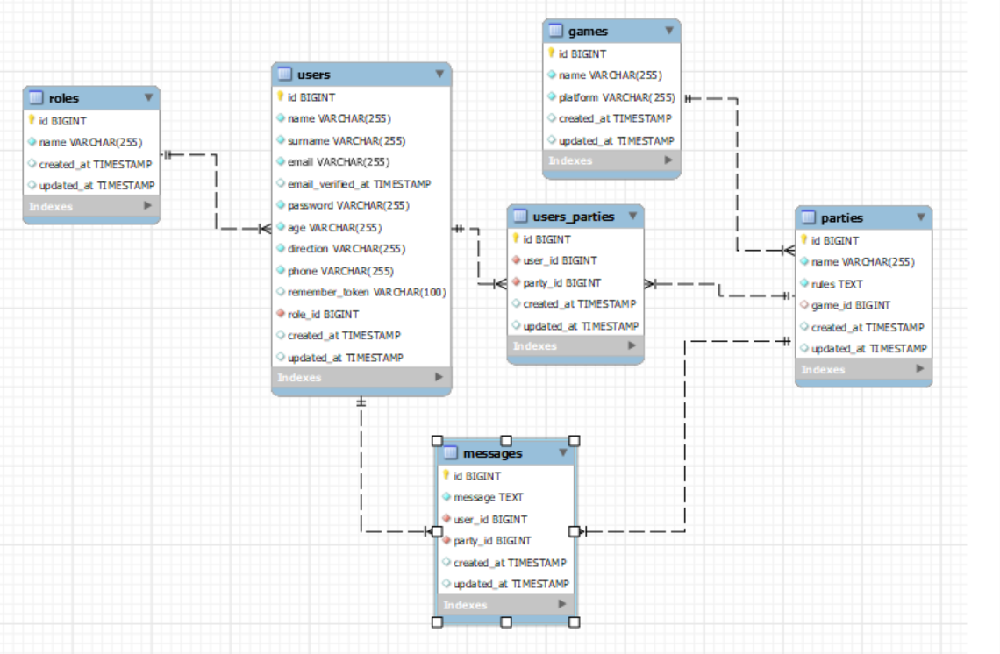

# lsl-geeks-# Welcome to my backend app laravel

<p align="center"></p>

<details>
  <summary>Contenido 📝</summary>
  <ol>
    <li><a href="#sobre-el-proyecto">Sobre el proyecto</a></li>
    <li><a href="#stack">Stack</a></li>
    <li><a href="#diagrama-bd">Diagrama</a></li>
    <li><a href="#instalación-en-local">Instalación</a></li>
    <li><a href="#endpoints">Endpoints</a></li>
    <li><a href="#futuras-funcionalidades">Futuras funcionalidades</a></li>
    <li><a href="#contribuciones">Contribuciones</a></li>
    <li><a href="#licencia">Licencia</a></li>
    <li><a href="#agradecimientos">Agradecimientos</a></li>
    <li><a href="#contacto">Contacto</a></li>
  </ol>
</details>

## Sobre el proyecto
El departamento de productos de GeeksHubs nos solicita crear el backend correspondiente a una aplicación web LFG, que
permita que los empleados puedan contactar con otros compañeros para formar grupos para jugar a un videojuego, con el objetivo de poder compartir un rato de ocio afterwork, un tipo de discord. Se creará una base de datos y una API REST. El usuario debe poder registrarse en la aplicación, iniciar sesión y acceder a su área de cliente. En su área de cliente debe poder ver los juegos que hay disponibles, crear y ver los mensajes en el canal ademas de unirse a cualquier canal o abandonarlo. También habrá un área de admin en el que puede crear juegos, borrar mensajes y borrar a cualquier usuario.     


## Stack
Tecnologías utilizadas:
<div align="center">
  <a href="https://git-scm.com/">
        
    </a>
    <a href="https://www.github.com/">
        
    </a>
    <a href="https://www.mysql.com/">
        
    </a>
     <a href="https://www.php.net/">
        
    </a>
     <a href="https://laravel.com/">
        
    </a>
<a href="https://developer.mozilla.org/es/docs/Web/JavaScript">
    
</a>
 </div>


## Diagrama BD


## Instalación en local
1. Clonar el repositorio
2. ` $ composer install `
3. Conectamos nuestro repositorio con la base de datos 
4. ``` $ php artisan serve ``` 
   
   Ahora ya pudes empezar a enviar peticiones....

## Endpoints
<details>
<summary>Endpoints</summary>

Cualquier usuario puede acceder:

- AUTH (Autentificacion)
    - REGISTRO
            POST localhost:8000/api/register
        body:
        ``` js
            {
                "name": "Juan",
                "surname": "Lucas",
                "email": "juan@juan.com",
                "password": "123456",
                "age": "37",
                "direction": "Jaen",
                "phone": "+34607854148"
            }
        ```
    La contraseña es encriptada usando bcrypt, nativo de laravel y despues es enviada a la base de datos.

    - LOGIN

            POST localhost:8000/api/login 
        body:
        ``` js
            {
              "email": "alvaro@alvaro.com",
              "password": "123456"
            }
        ```
    - VER MY PERFIL:

            GET  localhost:8000/api/profile
        
    - ACTUALIZAR MI PERFIL:

            PUT  localhost:8000/api/updateprofile/{id}
         body:
        ``` js
            {
                "name": "Isabel",
                "surname": "Bernabe",
                "age": "30",
                "direction": "Asturias",
                "phone": "+341687224"
            }
        ```
    - CREAR UN MENSAJE:

            POST  localhost:8000/api/createmessage
         body:
        ``` js
            {
                "party_id": "2",
                "message": "Los personajes...."
            }
        ```
    - VER TODOS LOS MENSAJES:

            GET  localhost:8000/api/getallmessages
    
    - VER LOS MENSAJES DE UN JUEGO:

            GET  localhost:8000/api/getmessagesbyparty/{id}
         
    - CREAR UN CANAL:

            POST  localhost:8000/api/createparty
          body:
        ``` js
            {
                "game_id": "2",
                "name": "Tetris",
                "rules": "Respetar al resto...."
            }
        ```
     - VER LOS CANALES DE UN JUEGO:

            GET  localhost:8000/api/party/{id}
         
Ademas como admin puedes:

    - VER TODOS LOS USUARIOS REGISTRADOS:

            GET  localhost:8000/api/getallusers
    
     - VER UN USUARIO EN CONCRETO:

            GET  localhost:8000/api/getuserbyid/{id}

    - BORRAR UN USUARIO:

            DELETE  localhost:8000/api/delete/{id}

     - BORRAR UN MENSAGE:

            DELETE  localhost:8000/api/deletemessage/{id}
         
    - MODIFICAR UN MENSAGE:

            PUT  localhost:8000/api/updatemessage/{id}

         body:
        ``` js
            {
                "message": "holaaaaa"
            }
        ```
    - CREAR UN MENSAGE:

            POST  localhost:8000/api/creategame

         body:
        ``` js
            {
                "name": "Muchos",
                "platform": "pc",
                "party_id": "2"
            }
        ```
</details>
## Futuras funcionalidades
Como futuras funcionalidades me gustaria añadir para que fuera mas completa mi aplicación las siguientes:
    - Ver solo mis mensajes como un usuario.
    - Poder modificar mi mensaje como usuario.
    - Poder borrar mis propios mensajes sin tener que ser admin.
    - Ver en los canales en los que he participado.
    - Entrar y salir de un canal.

## Contribuciones
Las sugerencias y aportaciones son siempre bienvenidas.  

Puedes hacerlo de dos maneras:

1. Abriendo una issue
2. Crea un fork del repositorio
    - Crea una nueva rama  
        ```
        $ git checkout -b feature/nombreUsuario-mejora
        ```
    - Haz un commit con tus cambios 
        ```
        $ git commit -m 'feat: mejora X cosa'
        ```
    - Haz push a la rama 
        ```
        $ git push origin feature/nombreUsuario-mejora
        ```
    - Abre una solicitud de Pull Request

## Licencia
Este proyecto se encuentra bajo licencia de "Creative Commons Zero".


## Agradecimientos:

Agradezco a mis compañeros el tiempo dedicado a este proyecto:

 **Dani**  
<a href="https://www.github.com/datata" target="_blank"></a> 

  **Jose**
<a href="https://github.com/JoseMarin" target="_blank"></a> 

  **Mara**
<a href="https://www.github.com/MaraScampini" target="_blank"></a> 

  **David**  
<a href="https://github.com/Dave86dev" target="_blank"></a> 

## Contacto
<a href = "Laura:lausnclu@gmail.com"></a>
<a href="https://www.linkedin.com/in/laura-sanchez-lucas-5b2222251/" target="_blank"></a> 
</p>
